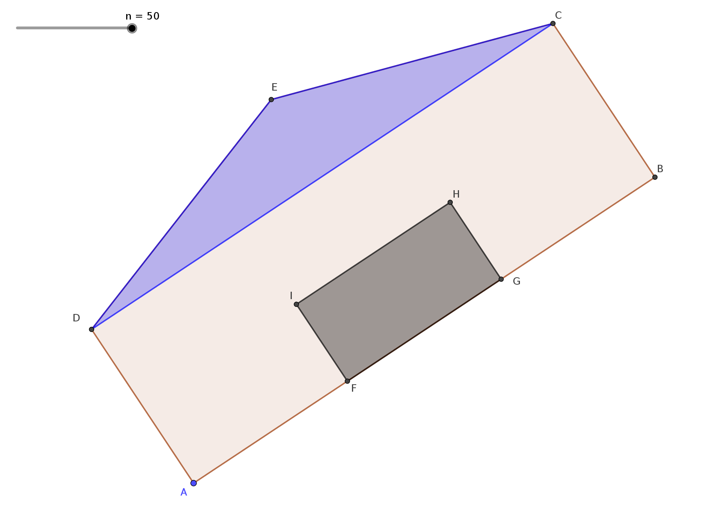

```{r setup, include=FALSE}
# The next command configures MANY things and loads quite a few packages.
# 
# If you want to see what's being done, execute 
# 
#   cat(
#     system.file(
#       "rmarkdown/resources/R/_common_report.R", 
#       package = "fnaufelRmd"
#     )
#   )
# 
# to find out the location of the file. Then open the file.
# 
# If you want to change the configuration, copy the file, edit it, and
# source it instead of the package file. 
# 
# Or simply write your commands here in this code chunk.

source(
  system.file(
    "rmarkdown/resources/R/_common_report.R",
    package = "fnaufelRmd"
  )
)

library(exercises)
exercises::iniciar()
```


# Instruções

* Fique à vontade para consultar os coleguinhas e para usar programas como o Geogebra, mas [somente soluções *analíticas* serão aceitas --- nada de responder no olhômetro.]{.hl}

* Documente da forma mais clara possível [todos os passos]{.hl} da resolução de cada questão.

* Entregue [(via Moodle)]{.hl} sua resolução escrita no formato que você preferir: manuscrito escaneado ou fotografado, documento gerado via $\LaTeX$ etc. O importante é que a resolução esteja legível. [Se você for fotografar sua resolução, use um aplicativo como [Clear Scan](https://play.google.com/store/apps/details?id=com.indymobileapp.document.scanner) para gerar um resultado melhor.]{.hl}

* Além da resolução por escrito, entregue também [(via Moodle)]{.hl} um arquivo contendo um vídeo de no máximo 5 minutos onde você explica em detalhes a resolução de uma parte da sua questão.

* Bom trabalho.


# Questão única: construindo uma casa 2D

[Veja o seu número nesta lista.](#nums)

Você vai achar equações para o chão, as paredes, a porta, e o telhado de uma casa no $\mathbb{R}^2$.

::: {.rmdimportant}

Em todos os seus cálculos e respostas, [use frações e radicais.]{.hl} 

[Não use valores numéricos com vírgulas decimais em momento algum.]{.hl}

:::


## Desenho {-}

Sua casa vai ficar assim. 

Não, o chão não vai ser horizontal.

A inclinação do chão vai depender do seu número [nesta lista](#nums).

```{r echo=FALSE}

```


## Chão {-}

* O chão da casa é o segmento que vai do ponto $A$ até o ponto $B$. 

* O ponto $A$ é a origem: $A = (0, 0)$.

* Use as coordenadas de $B$ que [correspondem ao seu número](#nums).

* Comece calculando [o vetor $\overrightarrow{AB}$]{.hl}.

  `r inicio_resposta()`
  
  * Chame as coordenadas de $B$ de $(x_B, y_B)$.
  
  * Então, $\overrightarrow{AB} = (x_B - 0, y_B - 0) = (x_B, y_B)$.
  
  `r fim_resposta()`

* Depois --- vá por mim --- [ache um vetor unitário]{.hl} na mesma direção e sentido que $\overrightarrow{AB}$.

  `r inicio_resposta()`
  
  * Basta dividir $\overrightarrow{AB}$ pelo seu módulo.
  
  * $|\overrightarrow{AB}| = \sqrt{x_B^2 + y_B^2}$.
  
  * [Independente das coordenadas do ponto $B$ sorteado para você, este módulo vai ser $12$]{.hl} (porque eu quis assim).
  
  * O vetor unitário na mesma direção e sentido de $\overrightarrow{AB}$ vai ser
  
    $$
    \overrightarrow{AB_U} = \left( \frac{x_B}{12}, \frac{y_B}{12} \right)
    $$
  
  `r fim_resposta()`

* Ache [a equação da reta que contém o chão]{.hl}.

  `r inicio_resposta()`
  
  * [Paramétricas:]{.hl}
  
    $\overrightarrow{AB} = (x_B, y_B)$ é um vetor diretor.
    
    Usando o ponto $A$:
    
    $$
    \begin{cases}
      x = 0 + x_B \cdot t \\
      y = 0 + y_B \cdot t
    \end{cases}
    $$
  
    Ou, usando o ponto $B$:
    
    $$
    \begin{cases}
      x = x_B + x_B \cdot t \\
      y = y_B + y_B \cdot t
    \end{cases}
    $$
    
  * [Cartesiana:]{.hl}
  
    Precisamos de um vetor normal (perpendicular) ao chão.
    
    Podemos usar $\overrightarrow{n_1} = (-y_B, x_B)$ ou $\overrightarrow{n_2} = (y_B, -x_B)$.
    
    A equação fica
    
    $$
    -y_Bx + x_By + \gamma = 0
    $$
    
    ou 
    
    $$
    y_Bx - x_By + \gamma = 0
    $$
    
    Como a reta passa pela origem, $\gamma = 0$.

    A equação fica
    
    $$
    -y_Bx + x_By = 0
    $$
    
    ou 
    
    $$
    y_Bx - x_By = 0
    $$
  
  * [Reduzida:]{.hl}
  
    $$
    y = \frac{\Delta y}{\Delta x}x + b \iff
    y = \frac{y_B}{x_B}x + b 
    $$
    Como a reta passa pela origem, $b = 0$. A equação fica
    $$
    y = \frac{y_B}{x_B}x
    $$
    
  `r fim_resposta()`

* Coordenadas de $B$ --- use o item que corresponde ao [valor de $n$ para a sua matrícula]{.hl}:

  ```{r echo=FALSE, results='asis'}
  xB <- c(
    '\\frac{4}{15}',
    '\\frac{8}{15}',
    '\\frac{4}{5}',
    '\\frac{16}{15}',
    '\\frac{4}{3}',
    '\\frac{8}{5}',
    '\\frac{28}{15}',
    '\\frac{32}{15}',
    '\\frac{12}{5}',
    '\\frac{8}{3}',
    '\\frac{44}{15}',
    '\\frac{16}{5}',
    '\\frac{52}{15}',
    '\\frac{56}{15}',
    '4',
    '\\frac{64}{15}',
    '\\frac{68}{15}',
    '\\frac{24}{5}',
    '\\frac{76}{15}',
    '\\frac{16}{3}',
    '\\frac{28}{5}',
    '\\frac{88}{15}',
    '\\frac{92}{15}',
    '\\frac{32}{5}',
    '\\frac{20}{3}',
    '\\frac{104}{15}',
    '\\frac{36}{5}',
    '\\frac{112}{15}',
    '\\frac{116}{15}',
    '8',
    '\\frac{124}{15}',
    '\\frac{128}{15}',
    '\\frac{44}{5}',
    '\\frac{136}{15}',
    '\\frac{28}{3}',
    '\\frac{48}{5}',
    '\\frac{148}{15}',
    '\\frac{152}{15}',
    '\\frac{52}{5}',
    '\\frac{32}{3}',
    '\\frac{164}{15}',
    '\\frac{56}{5}',
    '\\frac{172}{15}',
    '\\frac{176}{15}'
  )
  
  yB <- c(
    '\\frac{8}{15} \\; \\sqrt{506}',
    '\\frac{4}{15} \\; \\sqrt{2021}',
    '\\frac{16}{5} \\; \\sqrt{14}',
    '\\frac{28}{15} \\; \\sqrt{41}',
    '\\frac{16}{3} \\; \\sqrt{5}',
    '\\frac{4}{5} \\; \\sqrt{221}',
    '\\frac{8}{15} \\; \\sqrt{494}',
    '\\frac{4}{15} \\; \\sqrt{1961}',
    '\\frac{24}{5} \\; \\sqrt{6}',
    '\\frac{4}{3} \\; \\sqrt{77}',
    '\\frac{16}{15} \\; \\sqrt{119}',
    '\\frac{4}{5} \\; \\sqrt{209}',
    '\\frac{32}{15} \\; \\sqrt{29}',
    '\\frac{4}{15} \\; \\sqrt{1829}',
    '8 \\; \\sqrt{2}',
    '\\frac{4}{15} \\; \\sqrt{1769}',
    '\\frac{8}{15} \\; \\sqrt{434}',
    '\\frac{12}{5} \\; \\sqrt{21}',
    '\\frac{32}{15} \\; \\sqrt{26}',
    '\\frac{4}{3} \\; \\sqrt{65}',
    '\\frac{16}{5} \\; \\sqrt{11}',
    '\\frac{4}{15} \\; \\sqrt{1541}',
    '\\frac{8}{15} \\; \\sqrt{374}',
    '\\frac{4}{5} \\; \\sqrt{161}',
    '\\frac{8}{3} \\; \\sqrt{14}',
    '\\frac{4}{15} \\; \\sqrt{1349}',
    '\\frac{48}{5}',
    '\\frac{4}{15} \\; \\sqrt{1241}',
    '\\frac{16}{15} \\; \\sqrt{74}',
    '4 \\; \\sqrt{5}',
    '\\frac{8}{15} \\; \\sqrt{266}',
    '\\frac{4}{15} \\; \\sqrt{1001}',
    '\\frac{8}{5} \\; \\sqrt{26}',
    '\\frac{4}{15} \\; \\sqrt{869}',
    '\\frac{16}{3} \\; \\sqrt{2}',
    '\\frac{36}{5}',
    '\\frac{16}{15} \\; \\sqrt{41}',
    '\\frac{4}{15} \\; \\sqrt{581}',
    '\\frac{8}{5} \\; \\sqrt{14}',
    '\\frac{4}{3} \\; \\sqrt{17}',
    '\\frac{8}{15} \\; \\sqrt{86}',
    '\\frac{4}{5} \\; \\sqrt{29}',
    '\\frac{16}{15} \\; \\sqrt{11}',
    '\\frac{4}{15} \\; \\sqrt{89}'
  )
  
  b <- paste0(
    'B = \\left(', xB, ',\\;\\; ', yB, '\\right)$'
  )
  
  paste0(
    '1. $\\quad ',
    b,
    collapse = '\n\n'
  ) %>% 
    cat()
  ```


## Paredes {-}

* A [altura das paredes]{.hl}, sem contar o telhado (ou seja, a distância de $A$ a $D$), [é $1/3$ da largura da casa]{.hl}.

* As paredes são perpendiculares ao chão.

* Calcule as [coordenadas de $C$ e $D$]{.hl}.

  `r inicio_resposta()`
  
  * A largura da casa é a distância de $A$ a $B$, ou, o que dá no mesmo, o módulo do vetor $\overrightarrow{AB}$, que é $12$.
  
  * Vamos chamar a largura da casa de $L = 12$.
  
  * A altura das paredes vai ser $L/3 = 4$.
  
  * [Para achar o ponto $D$]{.hl}, basta achar um vetor que seja perpendicular ao chão, com sentido do chão para o teto, com módulo $4$.
  
  * É aqui que entra o vetor $\overrightarrow{AB_U}$ que achamos antes. Se invertermos a ordem das coordenadas de $\overrightarrow{AB_U}$ e trocarmos o sinal de uma delas, vamos ter o vetor $\overrightarrow{\text{parede}_U}$, um vetor unitário perpendicular ao chão.
  
  * Como o sentido que queremos é para cima e para a esquerda, a coordenada $x$ do vetor precisa ser negativa, e a coordenada $y$ do vetor precisa ser positiva.
  
  * Vamos usar $\overrightarrow{\text{parede}_U} = \left( \frac{-y_B}{12}, \frac{x_B}{12}\right)$. Perceba que, como $x_B$ e $y_B$ eram ambos maiores que zero, os sinais das coordenadas ficam como queremos.
  
  * Como $\overrightarrow{\text{parede}_U}$ é unitário, basta multiplicá-lo por $4$ e somar o resultado às coordenadas de $A$ para achar o ponto $D$:
  
    $$
    D = (0, 0) + 4 \cdot \left( \frac{-y_B}{12}, \frac{x_B}{12}\right) = \left( \frac{-y_B}{3}, \frac{x_B}{3}\right)
    $$
  
  * [Seguindo o mesmo raciocínio para $B$, chegamos ao ponto $C$:]{.hl}
  
    $$
    C = (x_B, y_B) + 4 \cdot \left( \frac{-y_B}{12}, \frac{x_B}{12}\right) = \left( x_B - \frac{y_B}{3}, y_B + \frac{x_B}{3}\right)
    $$
    
  `r fim_resposta()`

* Escreva as [equações das duas retas que contêm as paredes]{.hl}.

  `r inicio_resposta()`
  
  * Equações [paramétricas]{.hl} da reta que contém [$AD$]{.hl}:
  
    $$
    \begin{cases}
      x = -\frac{y_B}{3} \cdot t \\
      y = \frac{x_B}{3} \cdot t
    \end{cases}
    $$
    
  * Equação [cartesiana]{.hl} da reta que contém [$AD$]{.hl}:
  
    Usando o vetor $\overrightarrow{AB} = (x_B, y_B)$, normal à reta, a equação fica
    
    $$
    x_B \cdot x + y_B \cdot y + \gamma = 0
    $$
    
    Como $A = (0, 0)$ é ponto desta reta, $\gamma = 0$:

    $$
    x_B \cdot x + y_B \cdot y = 0
    $$

  * Equação [reduzida]{.hl} da reta que contém [$AD$]{.hl}:

    $$
    y = \frac{\Delta y}{\Delta x}x + b \iff
    y = \frac{-x_B / 3}{y_B / 3}x + b 
    $$

    Como a reta passa pela origem, $b = 0$. Então, a equação fica

    $$
    y = -\frac{x_B}{y_B}x
    $$
    
  * Equações [paramétricas]{.hl} da reta que contém [$BC$]{.hl}:
  
    $$
    \begin{cases}
      x = x_B -\frac{y_B}{3} \cdot t \\
      y = y_B + \frac{x_B}{3} \cdot t
    \end{cases}
    $$
    
  * Equação [cartesiana]{.hl} da reta que contém [$BC$]{.hl}:
  
    Usando o vetor $\overrightarrow{AB} = (x_B, y_B)$, normal à reta, a equação fica
    
    $$
    x_B \cdot x + y_B \cdot y + \gamma = 0
    $$
    
    Como $B = (x_B, y_B)$ é ponto desta reta:

    $$
    x_B \cdot x_B + y_B \cdot y_B + \gamma = 0
    \iff
    \gamma = -\left( x_B^2 + y_B^2 \right)
    $$
    
    e a equação fica

    $$
    x_B \cdot x + y_B \cdot y - \left( x_B^2 + y_B^2 \right) = 0
    $$
    
    Ou, como $x_B^2 + y_B^2 = 144$,

    $$
    x_B \cdot x + y_B \cdot y - 144 = 0
    $$

  * Equação [reduzida]{.hl} da reta que contém [$BC$]{.hl}:

    $$
    \begin{align}
    y = \frac{\Delta y}{\Delta x}x + b 
    &\iff
    y = \frac{y_B - y_B - x_B/3}{x_B - x_B + y_B/3}x + b \\
    &\iff
    y = -\frac{x_B}{y_B}x + b
    \end{align}
    $$

    Como o ponto $B = (x_B, y_B)$ pertence a esta reta:
    
    $$
    \begin{align}
    y = -\frac{x_B}{y_B}x + b
    &\iff
    y_B = -\frac{x_B}{y_B}x_B + b \\
    &\iff
    b = \frac{x_B^2}{y_B} + y_b \\
    &\iff
    b = \frac{x_B^2 + y_B^2}{y_B} \\
    &\iff
    b = \frac{144}{y_B}
    \end{align}
    $$
    
    E a equação fica
    
    $$
    y = -\frac{x_B}{y_B}x + \frac{144}{y_B}
    $$
    
  `r fim_resposta()`


## Telhado {-}

* A [altura do teto até o topo do telhado]{.hl} (o ponto $E$) [é $1/6$ da largura da casa]{.hl}.

  Ou seja, [a altura do chão até o topo do telhado é $1/2$ da largura da casa]{.hl}.
  
* As duas partes do telhado têm o mesmo comprimento.

* Calcule as [coordenadas de $E$]{.hl}.

  `r inicio_resposta()`
  
  * A distância do teto ao telhado é $L/6 = 2$.
  
  * Para achar o ponto $E$, primeiro achamos o ponto médio de $CD$, que vamos chamar de $M$:
  
    $$
    \begin{align}
      M 
      &= \left( 
        \frac{x_B - y_B/3 - y_B/3}{2},\;
        \frac{y_B + x_B/3 + x_B/3}{2} 
      \right) \\
      &= \left( 
          \frac{x_B}{2} - \frac{y_B}{3},\;
          \frac{y_B}{2} + \frac{x_B}{3}
      \right) \\
    \end{align}
    $$
  
  * Agora, multiplicamos o mesmo vetor unitário $\overrightarrow{\text{parede}_U}$ por $2$ e somamos às coordenadas de $M$ para "subir" de $M$ até $E$:
  
    $$
    \begin{align}
      E 
      &= 
      \left( 
          \frac{x_B}{2} - \frac{y_B}{3},\;
          \frac{y_B}{2} + \frac{x_B}{3}
      \right) +
      2 \cdot \left( \frac{-y_B}{12}, \frac{x_B}{12}\right) \\
      &=
      \left(
        \frac{x_B - y_B}{2},\;
        \frac{x_B + y_B}{2}
      \right)  
    \end{align}
    $$
  
  `r fim_resposta()`

* Ache as [equações das retas que contêm os lados do telhado]{.hl}.

  `r inicio_resposta()`
  
  * Vamos fazer só as equações [paramétricas]{.hl}.
  
  * [Para o lado $ED$]{.hl}, vamos precisar do vetor $\overrightarrow{ED}$:
  
    $$
    \begin{align}
      \overrightarrow{ED}
      &= 
      \left(
        \frac{-y_B}{3} - \frac{x_B - y_B}{2},\;
        \frac{x_B}{3} - \frac{x_B + y_B}{2}
      \right) \\
      &= 
      \left(
        \frac{y_B}{6} - \frac{x_B}{2},\;
        \frac{-y_B}{2} - \frac{x_B}{6}
      \right)
    \end{align}
    $$
  
  * Usando o ponto $D$, fazemos as equações paramétricas da reta que contém $ED$:
  
    $$
    \begin{cases}
      x = \frac{-y_B}{3} + 
        \left( \frac{y_B}{6} - \frac{x_B}{2}\right) \cdot t \\
      y = \frac{x_B}{3} +
        \left( \frac{-y_B}{2} - \frac{x_B}{6} \right) \cdot t
    \end{cases}
    $$
  
  * [Para o lado $EC$]{.hl}, vamos precisar do vetor $\overrightarrow{EC}$:
  
    $$
    \begin{align}
      \overrightarrow{EC}
      &= 
      \left(
        x_B - \frac{y_B}{3} - \frac{x_B - y_B}{2},\;
        y_B + \frac{x_B}{3} - \frac{x_B + y_B}{2}
      \right) \\
      &= 
      \left(
        \frac{y_B}{6} + \frac{x_B}{2},\;
        \frac{y_B}{2} - \frac{x_B}{6}
      \right)
    \end{align}
    $$
  
  * Usando o ponto $C$, fazemos as equações paramétricas da reta que contém $EC$:
  
    $$
    \begin{cases}
      x = x_B - \frac{y_B}{3} + 
        \left( \frac{y_B}{6} + \frac{x_B}{2} \right) \cdot t \\
      y = y_B + \frac{x_B}{3} +
        \left( \frac{y_B}{2} - \frac{x_B}{6} \right) \cdot t
    \end{cases}
    $$

  `r fim_resposta()`

* Use o [produto escalar]{.hl} para descobrir o [ângulo no topo do telhado]{.hl} (no ponto $E$).

  `r inicio_resposta()`
  
  * Usamos as coordenadas de $\overrightarrow{EC}$ e $\overrightarrow{ED}$ para achar o produto escalar:
  
    $$
    \begin{align}
      &
      \langle \overrightarrow{EC}, \overrightarrow{ED} \rangle \\
      &=
      \left( \frac{y_B}{6} + \frac{x_B}{2} \right) \cdot
      \left(\frac{y_B}{6} - \frac{x_B}{2} \right)
      \;+\;
      \left( \frac{y_B}{2} - \frac{x_B}{6} \right) \cdot
      \left( \frac{-y_B}{2} - \frac{x_B}{6} \right) \\
      &=
      - \frac29 \cdot \left(x_B^2 + y_B^2\right)
    \end{align}
    $$
  
    Lembrando que $|\overrightarrow{AB}| = \sqrt{x_B^2 + y_B^2} = 12$, vemos que $x_B^2 + y_B^2 = 144$.
    
    Daí, $\langle \overrightarrow{EC}, \overrightarrow{ED} \rangle = -32$.
    
  * O cosseno do ângulo $\theta$ entre $\overrightarrow{EC}$ e $\overrightarrow{ED}$ vai ser
  
    $$
    \cos \theta = 
    \frac{\langle \overrightarrow{EC}, \overrightarrow{ED} \rangle}
    {|\overrightarrow{EC}| \cdot |\overrightarrow{ED}|}
    $$
  
  * Precisamos do módulo de $\overrightarrow{EC}$ (que, aliás, vai ser igual ao módulo de $\overrightarrow{ED}$, pois os dois lados do telhado têm o mesmo comprimento):
  
    $$
    \begin{align}
      |\overrightarrow{EC}| = |\overrightarrow{ED}|
      &= 
      \sqrt{
        \left(\frac{y_B}{6} + \frac{x_B}{2}\right)^2
        \;+\;
        \left(\frac{y_B}{2} - \frac{x_B}{6}\right)^2 
      } 
      \\
      &=
      2\; \sqrt{10}
    \end{align}
    $$

  * Então
  
    $$
    \cos \theta = 
    \frac{\langle \overrightarrow{EC}, \overrightarrow{ED} \rangle}
    {|\overrightarrow{EC}| \cdot |\overrightarrow{ED}|} = 
    \frac{-32}{(2\;\sqrt{10})^2} = -\frac45
    $$
  
  * O que dá (usando uma calculadora):
  
    $$
    \theta = \arccos \left( -\frac45 \right) \approx 144^\circ
    $$
  
  `r fim_resposta()`

* Use o [produto escalar]{.hl} para achar a [área do triângulo azul]{.hl}.

  `r inicio_resposta()`
  
  * Na página $70$ do [livro (pdf)](https://canal.cecierj.edu.br/recurso/4690), vemos que a área do triângulo formado pelos vetores $\overrightarrow{EC}$ e $\overrightarrow{ED}$ é
  
    $$
    \frac12\; 
    \sqrt{
      |\overrightarrow{EC}|^2\;|\overrightarrow{ED}|^2 -
      \langle \overrightarrow{EC}, \overrightarrow{ED} \rangle^2
    }
    $$
  
  * No nosso caso, a área fica:
  
    $$
    \frac12\; 
    \sqrt{
      (2 \sqrt{10})^2\;(2 \sqrt{10})^2 - (-32)^2
    } \;=\; 12
    $$

  `r fim_resposta()`


## Porta {-}

* A [largura da porta]{.hl} é [$1/3$ da largura da casa]{.hl}. 

* A porta está centralizada horizontalmente na fachada.

* A [altura da porta]{.hl} é [$1/6$ da largura da casa]{.hl}.

* Calcule as [coordenadas de $H$ e $I$]{.hl}.


# Números dos alunos, por matrícula { #nums }

```{r echo=FALSE}
set.seed(1234)

matrícula <- c(
  220060041,
  122060031,
  122060020,
  122060013,
  122060034,
  122060021,
  822060037,
  122060006,
  622060027,
  215060056,
  122060005,
  122060008,
  122060017,
  122060012,
  622060024,
  122060007,
  122060003,
  122060004,
  622060025,
  122060029,
  221060040,
  122060033,
  122060041,
  122060009,
  122060016,
  122060038,
  122060028,
  122060030,
  119060029,
  221060047,
  122060023,
  122060015,
  122060010,
  122060014,
  122060036,
  622060026,
  122060018,
  122060011,
  122060019,
  122060022,
  122060040,
  122060035  
)  

n <- sample(1:length(matrícula))

df <- tibble(matrícula, n) %>% 
  arrange(matrícula)

df %>% kbl() %>% 
kable_paper(
  c('striped', 'hover'),
  full_width = FALSE
)
```


<div style='height: 1000px'></div>
